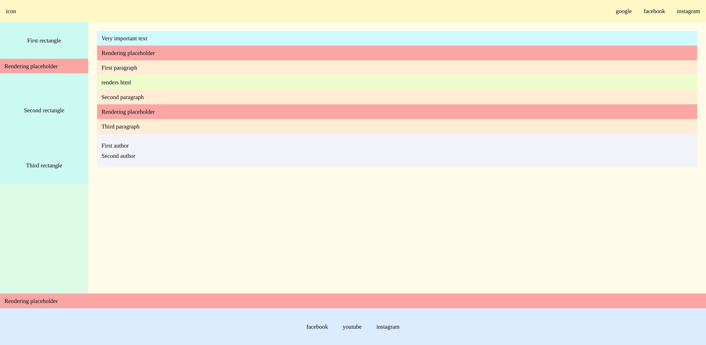
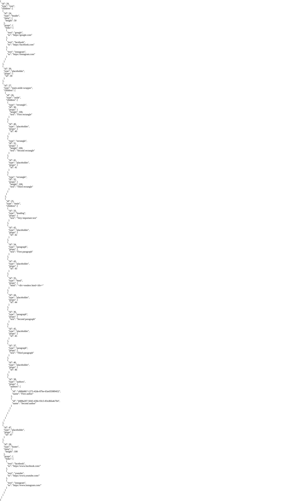
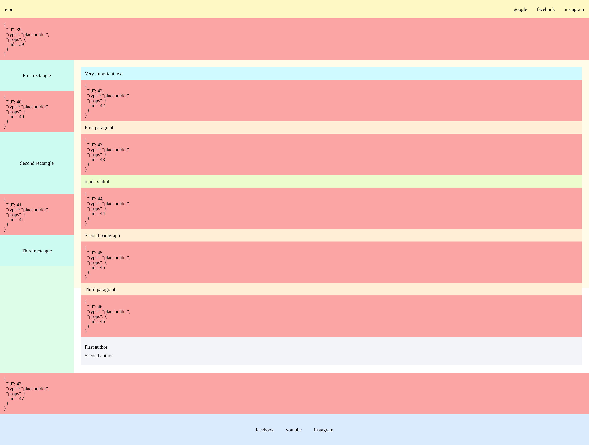

# React Tree Renderer

The project aims to solve a problem in which the DOM structure needs to be rendered dynamically based on responses from 2 independent APIs.

- The first step is to send an HTTP request to the API, which returns data with the content of the page.
- The second step is to transform the response from the first API into a tree structure that will be rendered in the DOM.
- The third step is to fill the tree structure with placeholders, in which the data from the second API will later be rendered.
- The fourth step is to send an HTTP request to the second API, which returns information in which placeholders to render the next elements.
- The final step is to render the tree structure.

### Application state after rendering data

### Applications state after showing website map as JSON

### Application state after rendering all placeholders

